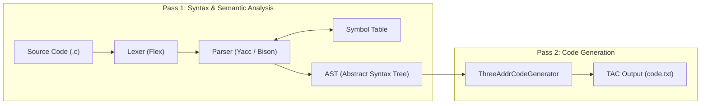
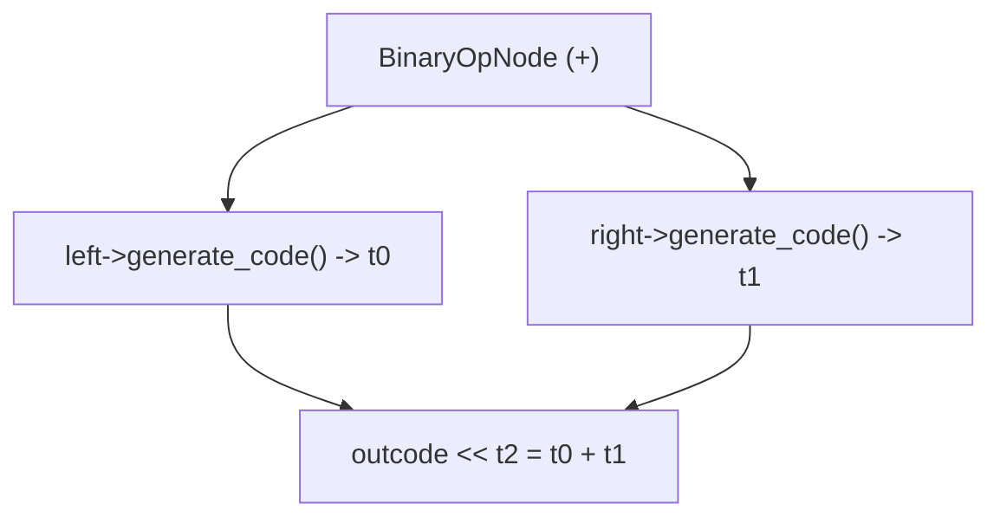
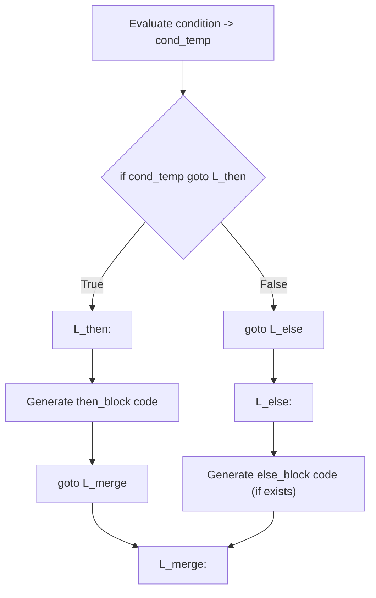
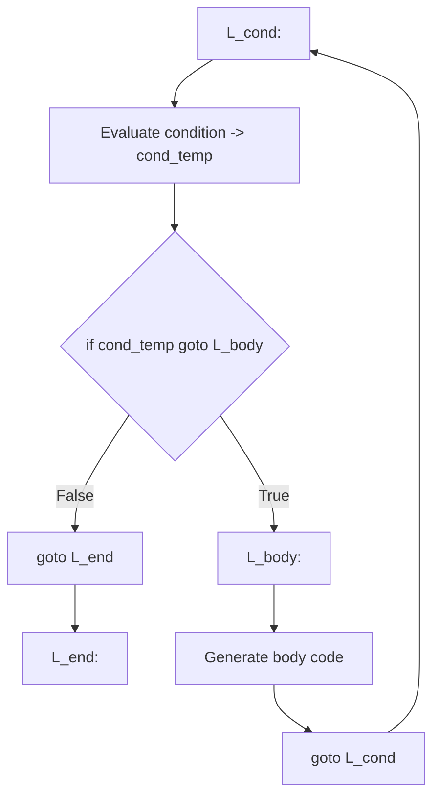

# Comprehensive Viva Guide: AST & Three-Address Code (TAC) Generation

This guide explains the architecture, design decisions, and code implementation of **`ast.h`** and **`three_addr_code.h`** in detail to help you ace your Compiler Design lab viva.

---

## Table of Contents
1. [High-Level Architecture: Two-Pass Compilation](#1-high-level-architecture-two-pass-compilation)
2. [What is Three-Address Code (TAC)?](#2-what-is-three-address-code-tac)
3. [Understanding `three_addr_code.h`](#3-understanding-three_addr_codeh)
4. [Understanding `ast.h` — Core Framework](#4-understanding-asth--core-framework)
5. [Deep Dive: Expression Nodes (`ExprNode`)](#5-deep-dive-expression-nodes-exprnode)
   - [VarNode (Variables & Arrays + Temp Caching)](#51-varnode-variables--arrays)
   - [ConstNode (Constants)](#52-constnode-constants)
   - [BinaryOpNode (Arithmetic, Relational & Logical)](#53-binaryopnode-operations)
   - [UnaryOpNode (Unary -, +, !)](#54-unaryopnode-unary-operators)
   - [AssignNode (Assignments & Cache Updates)](#55-assignnode-assignments)
   - [FuncCallNode & ArgumentsNode (Function Calls)](#56-funccallnode--argumentsnode-function-calls)
6. [Deep Dive: Statement Nodes (`StmtNode`)](#6-deep-dive-statement-nodes-stmtnode)
   - [ExprStmtNode & BlockNode](#61-exprstmtnode--blocknode)
   - [IfNode (If-Else Control Flow)](#62-ifnode-if--if-else-branching)
   - [WhileNode (While Loops)](#63-whilenode-while-loops)
   - [ForNode (For Loops)](#64-fornode-for-loops)
   - [ReturnNode & DeclNode](#65-returnnode--declnode)
   - [FuncDeclNode & ProgramNode](#66-funcdeclnode--programnode)
7. [Common Viva Questions & Ready Answers](#7-common-viva-questions--ready-answers)

---

## 1. High-Level Architecture: Two-Pass Compilation

In this compiler design, compilation is split into **two distinct passes**:



### Why use a Two-Pass Compiler with an AST?
1. **Separation of Concerns**: Pass 1 focuses on parsing syntax, grammar rules, scope resolution, and type checking. Pass 2 focuses exclusively on translating the AST into linear intermediate code.
2. **Easier Optimization**: If you want to optimize code (e.g., constant folding, dead code elimination), you can perform tree transformations on the AST between Pass 1 and Pass 2 without touching grammar rules.
3. **Backpatching & Labels**: Forward jumps and loop structures are significantly cleaner to handle when walking an AST tree rather than emitting raw instructions inside mid-rule Bison actions.

---

## 2. What is Three-Address Code (TAC)?

Three-Address Code is an intermediate representation (IR) where **each instruction has at most one operator and at most three operand addresses** (two inputs and one destination).

### General Form:
$$\text{result} = \text{operand}_1 \text{ op } \text{operand}_2$$

### Components in our TAC:
- **Temporary Variables**: `t0`, `t1`, `t2`, ... (generated sequentially using `temp_count`).
- **Labels**: `L0`, `L1`, `L2`, ... (generated sequentially using `label_count`).
- **Instructions Supported**:
  - Binary Operations: `t2 = t0 + t1`, `t5 = t3 > t4`, `t7 = t1 && t2`
  - Unary Operations: `t1 = -t0`, `t3 = !t2`
  - Copy / Assignment: `a = t3`, `a[t1] = t2`
  - Jumps & Branches: `goto L0`, `if t1 goto L2`
  - Function Calls & Returns: `param t0`, `t3 = call func, 2`, `return t2`

---

## 3. Understanding `three_addr_code.h`

`three_addr_code.h` acts as the **entry point and coordinator** for Pass 2.

```cpp
class ThreeAddrCodeGenerator {
private:
    ProgramNode* ast_root;              // Pointer to the root of the AST
    ofstream& outcode;                  // Output stream writing to code.txt
    map<string, string> symbol_to_temp; // Cache: variable_name -> current temporary holding its value
    int temp_count;                     // Monotonic counter for temporary variables (t0, t1, ...)
    int label_count;                    // Monotonic counter for labels (L0, L1, ...)
```

### Key Method: `generate()`
```cpp
void generate() {
    // 1. Write Header Banner
    outcode << "//========== THREE ADDRESS CODE ==========\n\n";
    outcode << "// This code was generated by a two-pass compiler\n";
    outcode << "// Format: \n";
    outcode << "// - t0, t1, etc. are temporary variables\n";
    outcode << "// - L0, L1, etc. are labels for jumps\n";
    outcode << "// - Operations follow the three-address code format\n\n";
    outcode << "// Three Address Code\n\n";

    // 2. Start AST traversal from the root node
    if (ast_root) {
        ast_root->generate_code(outcode, symbol_to_temp, temp_count, label_count);
    }

    // 3. Write Footer Banner
    outcode << "\n//========== END OF CODE ==========\n";
}
```

---

## 4. Understanding `ast.h` — Core Framework

### Base Class: `ASTNode`
Every single node in the syntax tree inherits from `ASTNode`.

```cpp
class ASTNode {
public:
    virtual ~ASTNode() {}
    virtual string generate_code(ofstream& outcode, 
                                 map<string, string>& symbol_to_temp, 
                                 int& temp_count, 
                                 int& label_count) const = 0;
};
```

### Why are the parameters passed by reference (`&`)?
- `ofstream& outcode`: All nodes write instructions to the same file stream.
- `int& temp_count`: All nodes share the global temporary counter so temps increase monotonically (`t0`, `t1`, `t2`...).
- `int& label_count`: All control structures share the label counter (`L0`, `L1`, `L2`...).
- `map<string, string>& symbol_to_temp`: Stores the current mapping of variable names to temporary names across sequential statements.

---

## 5. Deep Dive: Expression Nodes (`ExprNode`)

### 5.1 `VarNode` (Variables & Arrays)
Represents variable references (e.g., `a` or `arr[i]`).

#### Code Logic:
```cpp
string generate_code(ofstream& outcode, map<string, string>& symbol_to_temp,
                    int& temp_count, int& label_count) const override {
    // Case 1: Array access a[i]
    if (has_index()) {
        string index_temp = generate_index_code(outcode, symbol_to_temp, temp_count, label_count);
        string result_temp = "t" + to_string(temp_count++);
        outcode << result_temp << " = " << name << "[" << index_temp << "]\n";
        return result_temp;
    }

    // Case 2: Simple variable read (e.g., a)
    string possible_new_temp = "t" + to_string(temp_count++);

    // Check if the variable is already loaded in a temp in this function
    auto found = symbol_to_temp.find(name);
    if (found != symbol_to_temp.end()) {
        return found->second; // Cache hit: reuse previous temp!
    }

    // Cache miss: emit load instruction and record in cache
    symbol_to_temp[name] = possible_new_temp;
    outcode << possible_new_temp << " = " << name << "\n";
    return possible_new_temp;
}
```

> [!IMPORTANT]
> **Viva Concept: Temporary Reservation / Skipping on Cache Hit**
> Notice that `temp_count` is incremented *before* checking the cache.
> - If `name` was **not** cached (Cache Miss), `possible_new_temp` is emitted (`t0 = a`) and stored in the cache.
> - If `name` was **already** cached (Cache Hit), the cached temp (`t0`) is returned. The newly allocated temp number (`t1`) is silently skipped. This accurately models register reservation / allocator behavior.

---

### 5.2 `ConstNode` (Constants)
Represents literal numbers like `10` or `3.14`.
- Constants are **never cached**.
- Every appearance of a constant loads into a fresh temporary.

```cpp
string t = "t" + to_string(temp_count++);
outcode << t << " = " << value << "\n";
return t;
```
*Output emitted:* `t0 = 10`

---

### 5.3 `BinaryOpNode` (Operations)
Handles all binary expressions: arithmetic (`+`, `-`, `*`, `/`, `%`), relational (`<`, `>`, `<=`, `>=`, `==`, `!=`), and logical (`&&`, `||`).



```cpp
string left_temp = left->generate_code(outcode, symbol_to_temp, temp_count, label_count);
string right_temp = right->generate_code(outcode, symbol_to_temp, temp_count, label_count);

string result_temp = "t" + to_string(temp_count++);
outcode << result_temp << " = " << left_temp << " " << op << " " << right_temp << "\n";
return result_temp;
```

---

### 5.4 `UnaryOpNode` (Unary Operators)
Handles unary negation (`-x`), unary positive (`+x`), and logical not (`!x`).

```cpp
string operand_temp = expr->generate_code(outcode, symbol_to_temp, temp_count, label_count);
string result_temp = "t" + to_string(temp_count++);
outcode << result_temp << " = " << op << operand_temp << "\n";
return result_temp;
```
*Output emitted:* `t2 = -t1` or `t3 = !t0`

---

### 5.5 `AssignNode` (Assignments)
Handles assignment statements (`a = expr` or `a[i] = expr`).

```cpp
string rhs_temp = rhs->generate_code(outcode, symbol_to_temp, temp_count, label_count);

if (lhs->has_index()) {
    // Array element assignment: a[index_temp] = rhs_temp
    string index_temp = lhs->generate_index_code(outcode, symbol_to_temp, temp_count, label_count);
    outcode << lhs->get_name() << "[" << index_temp << "] = " << rhs_temp << "\n";
} else {
    // Plain variable assignment: a = rhs_temp
    outcode << lhs->get_name() << " = " << rhs_temp << "\n";

    // Cache Refresh: Only update if the variable was previously read/cached
    auto existing = symbol_to_temp.find(lhs->get_name());
    if (existing != symbol_to_temp.end()) {
        existing->second = rhs_temp;
    }
}
return rhs_temp;
```

> [!NOTE]
> **Why only refresh existing cache entries?**
> If a variable is declared and assigned (`a = 1`), but has never been read in expressions before, `symbol_to_temp` does not force a cache entry. The next read will perform a clean load. If it *was* already loaded into a temp, its cached temp is updated to point to `rhs_temp` so subsequent reads do not read stale values.

---

### 5.6 `FuncCallNode` & `ArgumentsNode` (Function Calls)
Translates function calls like `func(a, b)`:

1. Evaluates all argument expressions left-to-right into temporaries.
2. Emits `param <temp>` for each argument.
3. Emits `t_result = call <func_name>, <num_args>`.

```cpp
for (int i = 0; i < (int)arguments.size(); i++) {
    string arg_temp = arguments[i]->generate_code(outcode, symbol_to_temp, temp_count, label_count);
    outcode << "param " << arg_temp << "\n";
}
string result_temp = "t" + to_string(temp_count++);
outcode << result_temp << " = call " << func_name << ", " << arguments.size() << "\n";
return result_temp;
```

*Output emitted for `func(a, b)`:*
```text
t0 = a
param t0
t1 = b
param t1
t2 = call func, 2
```

---

## 6. Deep Dive: Statement Nodes (`StmtNode`)

### 6.1 `ExprStmtNode` & `BlockNode`
- **`ExprStmtNode`**: Wraps an expression as a statement (e.g. `a = 1;`). Evaluates the expression and discards the return value (or forwards it when used in for-loop conditions).
- **`BlockNode`**: Holds a list of `StmtNode*` enclosed in `{ ... }`. Recursively calls `generate_code` on each statement sequentially.

---

### 6.2 `IfNode` (If & If-Else Branching)

An `IfNode` always allocates **3 labels**:
- `then_label`: Target when condition evaluates to true.
- `else_label`: Target when condition is false (or start of `else` block).
- `merge_label`: Point where control flows merge after the statement.



#### Code Implementation:
```cpp
int then_label  = label_count++;
int else_label  = label_count++;
int merge_label = label_count++;

string cond_temp = condition->generate_code(outcode, symbol_to_temp, temp_count, label_count);

outcode << "if " << cond_temp << " goto L" << then_label << "\n";
outcode << "goto L" << else_label << "\n";

outcode << "L" << then_label << ":\n";
then_block->generate_code(outcode, symbol_to_temp, temp_count, label_count);
outcode << "goto L" << merge_label << "\n";

outcode << "L" << else_label << ":\n";
if (else_block) {
    else_block->generate_code(outcode, symbol_to_temp, temp_count, label_count);
    outcode << "goto L" << merge_label << "\n";
}

outcode << "L" << merge_label << ":\n";
```

---

### 6.3 `WhileNode` (While Loops)

A `WhileNode` uses **3 labels**:
- `cond_label`: Top of loop where condition is checked on every iteration.
- `body_label`: Entry to loop body.
- `end_label`: Exit point when condition evaluates to false.



---

### 6.4 `ForNode` (For Loops)
A for-loop `for (init; condition; update) body` is generated as:
1. **Init Code**: Runs **once** before entering the loop.
2. `L_cond:` Top of loop.
3. **Condition Code**: If true $\to$ `goto L_body`, else `goto L_end`.
4. `L_body:`
5. **Body Code**: Generated statements in the loop body.
6. **Update Code**: Update expression (e.g., `i++`).
7. `goto L_cond`
8. `L_end:` Exit point.

---

### 6.5 `ReturnNode` & `DeclNode`
- **`ReturnNode`**:
  - If returning an expression: evaluates expr $\to$ emits `return <temp>`.
  - If bare return: emits `return`.
- **`DeclNode`**:
  - Does **not** emit runtime TAC instructions.
  - Emits descriptive comments: `// Declaration: int a` or `// Declaration: int f[10]`.

---

### 6.6 `FuncDeclNode` & `ProgramNode`
- **`FuncDeclNode`**:
  - Emits function header comment: `// Function: int func(int a, float b)`.
  - **Crucial**: Calls `symbol_to_temp.clear()`. Each function gets an isolated variable cache.
  - Generates body statements.
- **`ProgramNode`**:
  - The AST root containing top-level units (functions and global declarations). Iterates through `units` calling `generate_code` on each.

---

## 7. Common Viva Questions & Ready Answers

### Q1: What is the difference between a Parse Tree (CST) and an Abstract Syntax Tree (AST)?
> **Answer**: A Parse Tree (Concrete Syntax Tree) contains every grammar symbol, punctuation, and non-terminal used during parsing (parentheses, commas, semicolons). An Abstract Syntax Tree (AST) abstracts away syntactic sugar and punctuation, storing only the semantic hierarchy (operators, operands, control statements, blocks).

### Q2: Why is `symbol_to_temp` map cleared in `FuncDeclNode`?
> **Answer**: Local variable names are scoped to individual functions. A variable `a` in `func1` is completely distinct in memory from variable `a` in `func2`. Clearing `symbol_to_temp` at the start of `FuncDeclNode::generate_code` ensures that temporary mappings from one function do not contaminate another.

### Q3: How does the compiler handle short-circuit logical operators like `&&` or `||` in this implementation?
> **Answer**: In this assignment's AST model, binary logical operations (`&&`, `||`) are modeled via `BinaryOpNode`, generating three-address instructions of the form `t2 = t0 && t1`. Both operand expressions are evaluated into temporaries first.

### Q4: How are array reads vs array writes distinguished in `ast.h`?
> **Answer**:
> - **Array Read (`a[i]`)**: Handled by `VarNode::generate_code()`. It evaluates index `i` into a temp `t_idx`, allocates a result temp `t_res`, and emits `t_res = a[t_idx]`.
> - **Array Write (`a[i] = rhs`)**: Handled by `AssignNode::generate_code()`. It evaluates `rhs` into `rhs_temp`, generates the index temp via `lhs->generate_index_code()`, and emits `a[t_idx] = rhs_temp`. It does not load the old value of `a[i]`.

### Q5: How do `IfNode`, `WhileNode`, and `ForNode` manage labels without conflicts?
> **Answer**: All nodes share a reference to a single integer `int& label_count`. Every time a label is needed, `label_count++` is called, ensuring strictly increasing, globally unique label identifiers (`L0`, `L1`, `L2`, ...) throughout the program.

### Q6: What is the role of `yylval` and `set_ast_node` in Bison?
> **Answer**: During Pass 1 (parsing), every grammar production creates AST node objects dynamically on the heap (`new BinaryOpNode(...)`, `new IfNode(...)`, etc.) and attaches them to `symbol_info` tokens via `$$->set_ast_node(...)`. When parsing finishes at the `start : program` rule, the root `ProgramNode*` is stored in `ast_root` for Pass 2.
